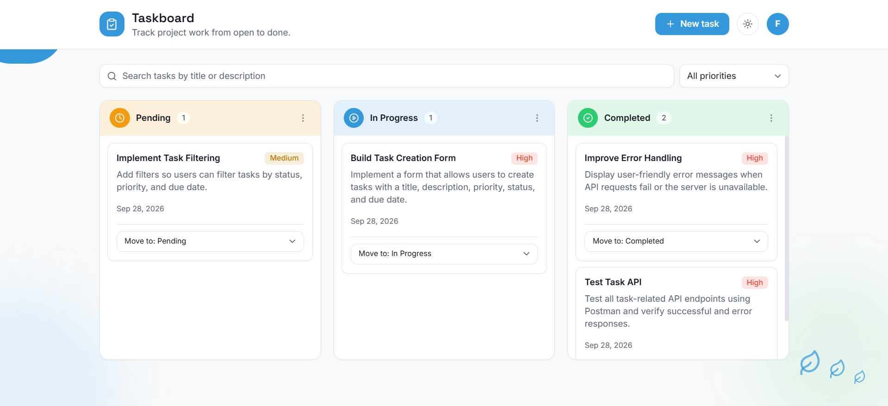
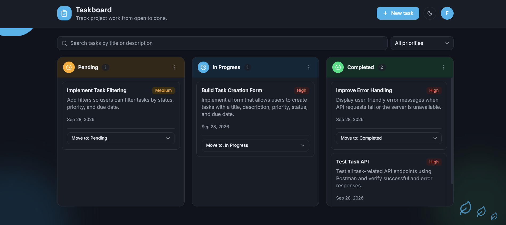
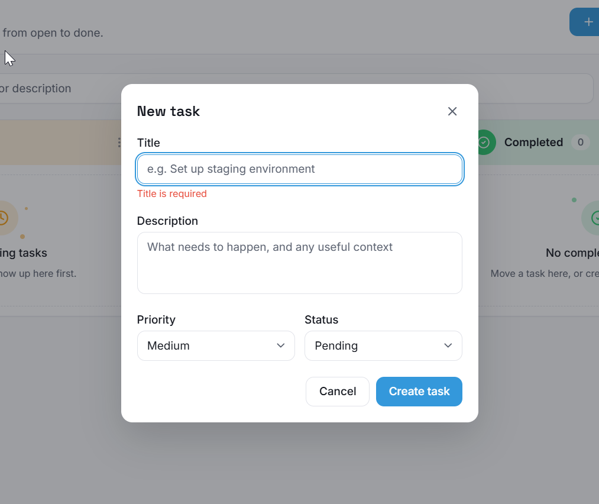
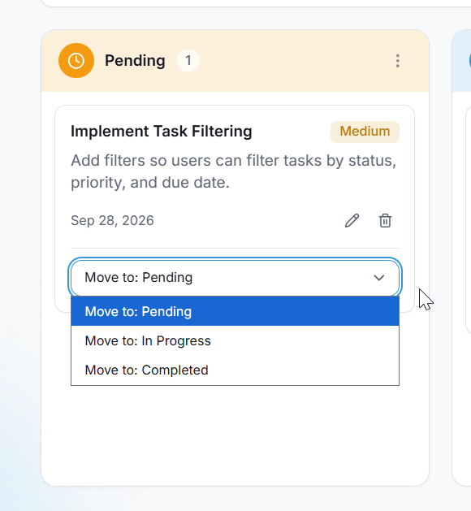
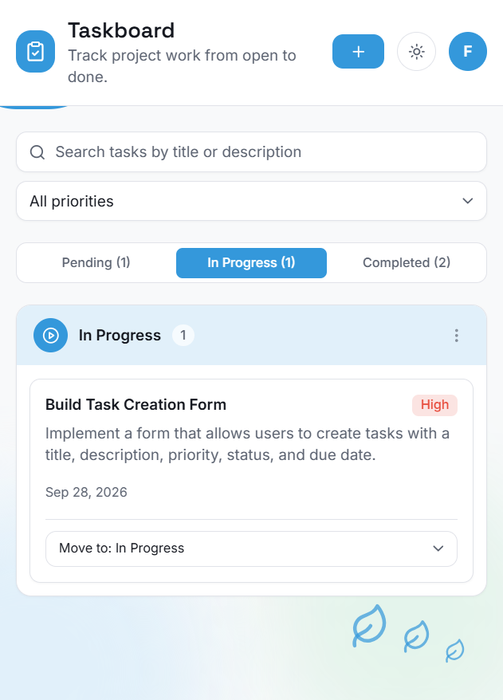

# Taskboard

A responsive project and task management portal. Create, edit, delete and move tasks across a Pending, In Progress and Completed board. Built with Next.js, TypeScript and Tailwind CSS, and installable as a PWA.

- **Live app:** https://task-portal-frontend-tau.vercel.app
- **Backend repository:** https://github.com/YOUR-USERNAME/task-portal-backend
- **Live API:** https://task-portal-backend-aarf.onrender.com/api/health

> **About the live demo:** the backend runs on a free hosting tier. It sleeps when idle, so the first load may take around a minute while it wakes up, and it resets its database on restart (re-seeding sample tasks). The board shows loading placeholders while it waits.

## Screenshots

### Desktop board (light and dark)



*Tasks are grouped by status with live counts, plus search and a priority filter.*



*Dark mode. The choice is remembered, and the system setting is used on the first visit.*

### Task form validation and status change

| New task validation | Status change from the card |
|---|---|
|  |  |
| The title is required, with an inline error message. | Move a task between columns with the dropdown, with edit and delete actions alongside. |

### Mobile layout



*Below 640px the columns become tabs, each showing its task count.*

## Features

- **Kanban board** with three columns (Pending, In Progress, Completed). On mobile it collapses into a tabbed single-column view.
- **Full task management:** create, edit, delete, and change status from the card.
- **Form validation** with inline field errors, plus server-side validation from the API.
- **Loading skeletons** while data loads and **toast notifications** for every success and error.
- **Delete confirmation** dialog, keyboard accessible (Escape closes it).
- **Empty states** per column that guide the next action.
- **Search and priority filter**, with debounced search.
- **Optimistic updates** for status changes and deletes, with automatic rollback if the request fails.
- **Error state** with a Retry button when the API is unreachable.
- **Dark mode** toggle that remembers your choice and respects your system setting on first visit.
- **PWA support** (bonus): installable, with an offline-capable app shell.

## Tech stack

- Next.js 14 (App Router), React 18, TypeScript
- Tailwind CSS with a CSS-variable design system (light and dark themes)
- lucide-react icons
- Space Grotesk and Inter fonts via `next/font`

## Getting started

### Prerequisites

- Node.js 18 or newer and npm
- The backend API running. Follow the setup steps in the backend repository first: https://github.com/YOUR-USERNAME/task-portal-backend

### Run locally

```bash
git clone https://github.com/YOUR-USERNAME/task-portal-frontend.git
cd task-portal-frontend
cp .env.example .env.local
npm install
npm run dev
```

Open **http://localhost:3000**. The app expects the API at `http://localhost:4000/api` by default.

### Production build

```bash
npm run build
npm start
```

### Run with Docker

```bash
docker build -t taskboard-web .
docker run -p 3000:3000 taskboard-web
```

`NEXT_PUBLIC_API_URL` is baked in at build time. To point a Docker build at a different API, pass it as a build argument or set it in the environment before building, then rebuild.

## Environment variables

Copy `.env.example` to `.env.local`.

| Variable | Default | Description |
|---|---|---|
| `NEXT_PUBLIC_API_URL` | `http://localhost:4000/api` | Base URL of the backend API. Include `/api`, no trailing slash. **Changing it requires a rebuild.** |

## Project structure

```
src/
├── app/
│   ├── layout.tsx           # fonts, theme script, PWA metadata
│   ├── page.tsx
│   ├── manifest.ts          # web app manifest
│   └── globals.css          # design tokens (light and dark)
├── components/              # TaskBoard, TaskColumn, TaskCard, TaskFormModal,
│                            # ConfirmDialog, FilterBar, Header, toasts, ...
│   └── ui/                  # Button, Input, Select, Textarea, Skeleton
├── hooks/
│   └── useTasks.ts          # data fetching and mutations
└── lib/
    ├── api.ts               # typed API client
    ├── types.ts
    └── utils.ts
public/
├── sw.js                    # service worker
└── icons/                   # PWA icons
scripts/
└── generate-icons.mjs       # regenerates the PWA icons
docs/
└── screenshots/             # images used in this README
```

## PWA support

This is the assignment's bonus feature. It is additive and does not change the core flows.

- **Web app manifest** (`src/app/manifest.ts`) with name, theme color and icons, so the app can be installed to a phone or desktop.
- **Icons** in `public/icons/` (192px and 512px). They are generated by `scripts/generate-icons.mjs` with no dependencies, using `node scripts/generate-icons.mjs`.
- **Service worker** (`public/sw.js`):
  - Pages: network first, falling back to the cached app shell when offline.
  - Built static assets: cache first.
  - **API calls are never cached**, so task data is always live. When offline you see the shell with the "Couldn't reach the server" banner rather than stale data.
- The service worker registers **in production builds only**, so it does not interfere with development.

To try it:

```bash
npm run build && npm start
```

Open http://localhost:3000 in Chrome, then DevTools, then Application. Check Manifest and Service Workers, and look for the install icon in the address bar.

## Design notes

- **Palette:** a blue accent with amber, blue and green status colors (Pending, In Progress, Completed) and red, amber and green priority badges, on a soft neutral background.
- **Typography:** Space Grotesk for headings, Inter for body text.
- **Theming:** every color is a CSS variable consumed through Tailwind, so dark mode is a single class toggle with no per-component overrides.
- **Accessibility:** visible keyboard focus, labelled controls and dialogs, `aria-live` toasts, and reduced-motion support.

## Deployment

The frontend is deployed on Vercel and the API on Render. To deploy your own copy:

1. Deploy the backend and note its URL.
2. On Vercel, import this repository and set `NEXT_PUBLIC_API_URL` to `https://YOUR-API-URL/api` before deploying.
3. Set the backend's `CORS_ORIGIN` to your Vercel URL (no trailing slash).

## AI usage disclosure

This project was developed with Claude (Anthropic) used as a supporting development assistant. AI was used to help understand the assignment requirements, plan the project structure, troubleshoot errors and build issues, and improve documentation.

The project was not entirely created by AI. I made the implementation decisions, reviewed and understood the suggested solutions, tested the application, fixed issues, handled deployment and configuration, and made the final design and code adjustments myself.